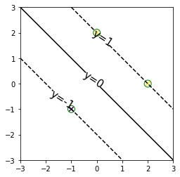
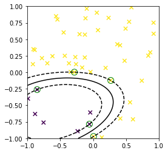
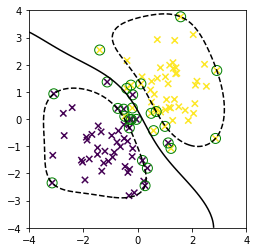
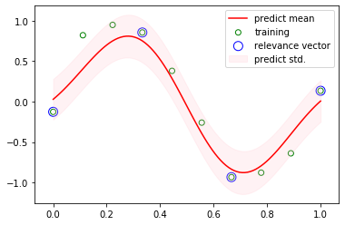
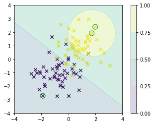

# CS405 Homework 6

*Course: Machine Learning(CS405) - Professor: Qi Hao*

## Question 1

Suppose we have a data set of input vectors $\{\mathbf x_n\}$ with corresponding target values $t_n \in \{-1,1\}$, and suppose that we model the density of input vectors within each class separately using a Parzen kernel density estimator with a kernel $k(\mathbf{x,x'})$.

(a) Write down the minimum misclassification-rate decision rule assuming the two classes have equal prior probability.

(b) Show that if the kernel is chosen to be $k(\mathbf{x,x'})= \mathbf{x^T x'}$, then the classification rule reduces to simply assigning a new input vector to the class having the closest mean.

(c) Show that if the kernel takes the form $k(\mathbf{x,x'}) = \phi(\mathbf x)^T\phi(\mathbf x')$, then the classification is based on the closest mean in the feature space $\phi(\mathbf x)$.

## Question 2

Consider the logistic regression model with a target variable $t \in \{-1,1\}$. If we define $p(t = 1|y) = \sigma(y)$ where $y(\mathbf x)$ is given by

$$y(\mathbf x) = \mathbf w^T\phi(\mathbf x) + b$$

show that the negative log likelihood, with the addition of a quardratic regularization term, takes the form

$$\sum^N_{n=1}E_{LR}(y_nt_n) + \lambda\|\mathbf{w}\|^2$$

## Question 3

By performing the Guassian integral over $\mathbf w$ in

$$p(\mathbf{t|X},\alpha,\beta) = \int p(\mathbf{t|X,w},\beta)p(\mathbf w,\alpha)\mathrm d\mathbf w$$

using the technique of complrting the square in the exponential, derive the result for the marginal likelihood function in the regression RVM:

$$\mathrm{ln}p(\mathbf{t|X},\alpha,\beta) = -\frac{1}{2}\{N\mathrm{ln}(2\pi) + \mathrm{ln}|\mathbf{C}| + \mathbf{t^T C^{-1}t}\}$$

## Question 4

Show that direct maximization of the log marginal likelihood 

$$\begin{aligned}\mathrm{ln}p(\mathbf{t|X},\alpha,\beta) &= \ln{\mathcal{N}}(\mathbf{t}|0,\mathbf{C})\\&= -\frac{1}{2}\{N\mathrm{ln}(2\pi) +\mathrm{ln}|\mathbf C| + \mathbf{t^T C^{-1}t}\}\end{aligned}$$

for the regression relevance vector machine leads to the re-estimation equations

$$\alpha_i^{new}=\frac{\gamma_i}{m_i^2}$$

and

$$(\beta^{new})^{-1}=\frac{||\mathbf{t-\Phi m}||^2}{N-\sum_i\gamma_i}$$

where $\gamma_i$ is defined by

$$\gamma_i=1-\alpha_i\sum\nolimits_{ii}$$

## Question 5

Kernel functions implicitly define some mapping function $\phi(\cdot)$ that transforms an input instance $x\in\mathbb{R}^d$ to high dimensional space $Q$ by giving the form of dot product in $Q: K(\mathbf{x}_i,\mathbf{x}_j) \equiv <\phi(\mathbf{x}_i),\phi(\mathbf{x}_j)>$

(a) Prove that the kernel is symmetric, i.e. $K(\mathbf{x}_i,\mathbf{x}_j)=K(\mathbf{x}_j,\mathbf{x}_i)$

(b) Assume we use radial basis kernel function  $K(\mathbf{x}_i,\mathbf{x}_j) = \exp(-\frac{1}{2}||\mathbf{x}_i-\mathbf{x}_j||^2)$.  Thus there is some implicit unknown mapping function $\phi(x)$. Prove that for any two input instances $\mathbf{x}_i$ and $\mathbf{x}_j$ , the squared Euclidean distance of their corresponding points in the feature space $Q$ is less than 2, i.e. prove that $||\phi(\mathbf{x}_i)-\phi(\mathbf{x}_j)||^2\leq 2$.

**Hint.** $$||\phi(\mathbf{x}_i)-\phi(\mathbf{x}_j)||^2 = <\phi(\mathbf{x}_i),\phi(\mathbf{x}_i)>+<\phi(\mathbf{x}_j),\phi(\mathbf{x}_j)>-2\cdot<\phi(\mathbf{x}_i),\phi(\mathbf{x}_j)>$$

## Question 6

With the help of a kernel function, SVM attempts to construct a hyper-plane in the feature space $Q$ that maximizes the margin between two classes. The classification decision of any $\mathbf{x}$ is made on the basis of the sign of

$$<\hat{\mathbf{w}},\phi(x)>+\hat{w}_0=\sum_{i\in SV} y_i\alpha_iK(\mathbf{x}_i,\mathbf{x})+\hat{w}_0=f(\mathbf{x};\alpha,\hat{w}_0)$$

where $\hat{\mathbf{w}}$ and $\hat{w}_0$ are parameters for the classification hyper-plane in the feature space $Q$, $SV$ is the set of support vectors, and $\alpha_i$ is the coefficient for the $i$-th support vector. Again we use the radial basis kernel function. Assume that the training instances are linearly separable in the feature space $Q$, and assume that the SVM finds a margin that perfectly separates the points.

If we choose a test point $\mathbf{x}_{far}$ which is far away from any training instance $\mathbf{x}_i$ (distance here is measured in the original space $\mathbb{R}^d$), prove that 

$$f(\mathbf{x};\alpha,\hat{w}_0)\approx\hat{w}_0$$

**Hint.** We have that $||\mathbf{x}_{far}-\mathbf{x}_i ||>> 0 \qquad \forall i \in SV$

## Program Question

Please finish the codes in classes __RBF__, **PloynomialKernel**, **SupportVectorClassifier**, **RelevanceVectorRegressor**, **RelevanceVectorClassifier**, show the figures as below.

<figure class='half'>
    
    
    </figure>

 

<b>Figure 1&2. Maximum Margin Classifiers</b>

<b>Figure 3. Overlapping Class Distributions</b>

    <figure class='half'>
        
        
    </figure>

<b>Figure 4&5. RVM for Regression and Classification</b>

