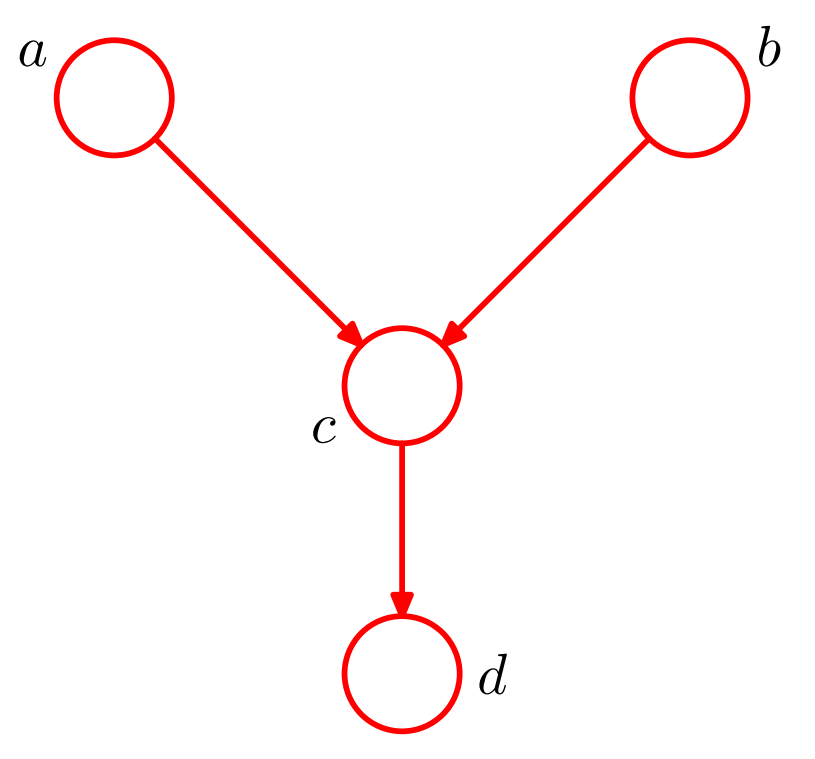
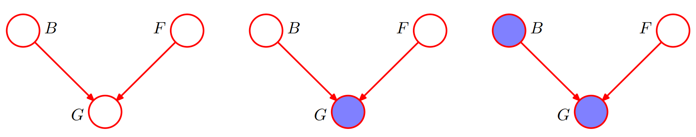
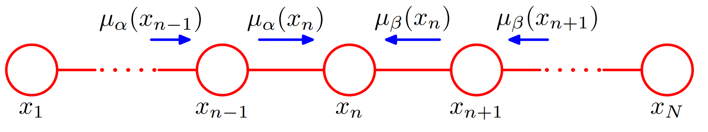
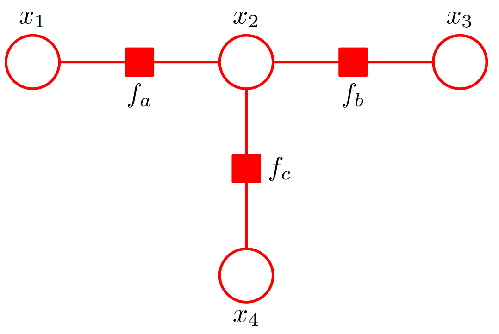

# CS405 Homework 8

*Course: Machine Learning(CS405) - Professor: Qi Hao*

## Question 1

Evaluate the distributions $p(a)$, $p(b|c)$, and $p(c|a)$ corresponding to the joint distribution given in Table \ref{table1}.  Hence show by direct evaluation that $p(a, b, c) = p(a)p(c|a)p(b|c)$.  Draw the corresponding directed graph.

<b>Table 1. The joint distribution over three binary variables.</b>

| a    | b    | c    | p(a,b,c) |
| ---- | ---- | ---- | -------- |
| 0    | 0    | 0    | 0.192    |
| 0    | 0    | 1    | 0.144    |
| 0    | 1    | 0    | 0.048    |
| 0    | 1    | 1    | 0.216    |
| 1    | 0    | 0    | 0.192    |
| 1    | 0    | 1    | 0.064    |
| 1    | 1    | 0    | 0.048    |
| 1    | 1    | 1    | 0.096    |

## Question 2

Consider the directed graph shown in Figure 1 in which none of the variables is observed.

(a) Show that $a ⫫ b|\emptyset$

(b) Suppose we now observe the variable d. Show that in general $a \not ⫫ b | d$.

**Figure 1.** Example of a graphical model used to explore the conditional independence properties of the head-to-head path $a-c-b$ when a descendant of $c$, namely the node $d$, is observed.

## Question 3

Consider the example of the car fuel system shown in Figure 2, and suppose that instead of observing the state of the fuel gauge $G$ directly, the gauge is seen by the driver $D$ who reports to us the reading on the gauge. This report is either that the gauge shows full $D = 1$ or that it shows empty $D = 0$. Our driver is a bit unreliable, as expressed through the following probabilities

$$p(D = 1| G = 1) = 0.9$$

$$p(D = 0 | G = 0) = 0.9$$.

Suppose that the driver tells us that the fuel gauge shows empty, in other words that we observe $D = 0$.

(a) Evaluate the probability that the tank is empty given only this observation.

(b) Evaluate the corresponding probability given also the observation that the battery is flat, and note that this second probability is lower.

**Figure 2.** A 3-node graph used to illustrate the phenomenon of ‘explaining away’. The three nodes represent the state of the battery ( $B$ ), the state of the fuel tank ( $F$ ) and the reading on the electric fuel gauge ( $G$ ).

## Question 4

Consider a graph of the form shown in Figure 3 having $N = 5$ nodes, in which nodes $x_3$ and $x_5$ are observed.

(a) Use d-separation to show that $x_2 ⫫ x_5 | x_3$.

(b) Show that if the message passing algorithm of Section 8.4.1 is applied to the evaluation of $p(x_2|x_3, x_5)$, the result will be independent of the value of $x_5$.

**Figure 3.** The marginal distribution $p(x_n)$ for a node $x_n$ along the chain is obtained by multiplying the two messages $\mu_\alpha(x_n)$ and $\mu_\beta(x_n)$, and then normalizing. These messages can themselves be evaluated recursively by passing messages from both ends of the chain towards node $x_n$.

## Question 5

Consider the message passing protocol for the sum-product algorithm on a tree-structured factor graph in which messages are first propagated from the leaves to an arbitrarily chosen root node and then from the root node out to the leaves. Use proof by induction to show that the messages can be passed in such an order that at every step, each node that must send a message has received all of the incoming messages necessary to construct its outgoing messages.

## Question 6

Equation (1) verifies that the sum-product algorithm run on the graph in Figure 4 with node $x_3$ designated as the root node gives the correct marginal for $x_2$.

(a) Show that the correct marginals are obtained also for $x_1$ and $x_3$.

(b) Shown that the use of equation (2) after running the sum-product algorithm on this graph gives the correct joint distribution for $x_1$, $x_2$.

$$\begin{equation}\begin{aligned}\widetilde{p}(x_2) &= \mu_{f_a\rightarrow x_2}(x_2)\mu_{f_b\rightarrow x_2}(x_2)\mu_{f_c\rightarrow x_2}(x_2) \\\ &= \left[\sum_{x_1}f_a(x_1, x_2)\right]\left[\sum_{x_3}f_b(x_2, x_3)\right]\left[\sum_{x_4}f_c(x_2, x_4)\right] \\\ &= \sum_{x_1}\sum_{x_3}\sum_{x_4}f_a(x_1, x_2)f_b(x_2, x_3)f_c(x_2, x_4) \\\ &= \sum_{x_1}\sum_{x_3}\sum_{x_4}\widetilde{p}(\mathbf x)\end{aligned}\end{equation}\space\space\space\space\space\space\space\space\space(1)$$

$$\begin{equation}p(\mathbf x_s) = f_s(\mathbf x_s)\prod_{i\in ne(f_s)}\mu_{x_i\rightarrow f_s}(x_i)\end{equation}\space\space\space\space\space\space\space\space(2)$$

  <b>
Figure 4. A simple factor graph used to illustrate the sum-product algorithm.
  </b>

