# CS405 Machine Learning

### Lab #1 Install Python

In this tutorial, you will learn which version of Python to choose for download and how to install it on Windows 10. Also, I am giving an example to download, install and configure PyCharm IDE on Windows 10. By setting up all this, you would be able to develop and run Python applications efficiently. Follow these steps to perform the tasks.


## Part 1: Download and Install Python

### I. For Windows Users[^1]:

Installing and using Python on Windows 10 is very simple. The installation procedure involves just three steps:

1. Download the binaries
2. Run the Executable installer
3. Add Python to PATH environmental variables

To install Python, you need to download the official Python executable installer. Next, you need to run this installer and complete the installation steps. Finally, you can configure the PATH variable to use python from the command line. You can choose the version of Python you wish to install. It is recommended to install the latest version of Python, which is 3.7.3 at the time of writing this article.

#### Step 1: Download the Python Installer binaries

1. Open the [official Python website](https://www.python.org/downloads/windows/) in your web browser. Navigate to the Downloads tab for Windows.

2. Choose the latest Python 3 release. In our example, we choose the latest Python 3.7.3 version.

3. Click on the link to download **Windows x86 executable installer** if you are using a 32-bit installer. In case your Windows installation is a 64-bit system, then download **Windows x86-64 executable installer**.


#### Step 2: Run the Executable Installer

1. Once the installer is downloaded, run the Python installer.
2. Check the **Install launcher for all users** check box. Further, you may check the **Add Python 3.7 to path** check box to include the interpreter in the execution path.

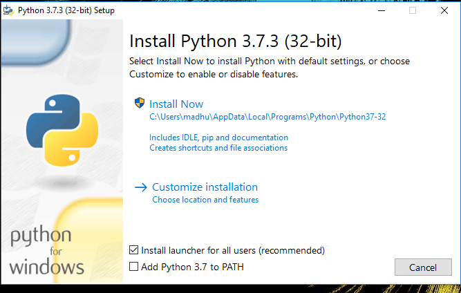

3. Select **Customize installation**. Choose the optional features by checking the following check boxes:

   - Documentation

   - [pip](https://www.digitalocean.com/community/tutorials/python-pip)

   - tcl/tk and IDLE (to install tkinter and IDLE)

   - Python test suite (to install the standard library test suite of Python)

   - Install the global launcher for `.py` files. This makes it easier to start Python

   - Install for all users.

   

   ​			Click **Next**. This takes you to **Advanced Options** available while installing Python.

   4. Here, select the **Install for all users** and **Add Python to environment variables** check boxes. Optionally, you can select the **Associate files with Python**, **Create shortcuts for installed applications** and other advanced options. Make note of the python installation directory displayed in this step. You would need it for the next step. After selecting the Advanced options, click **Install** to start installation.

      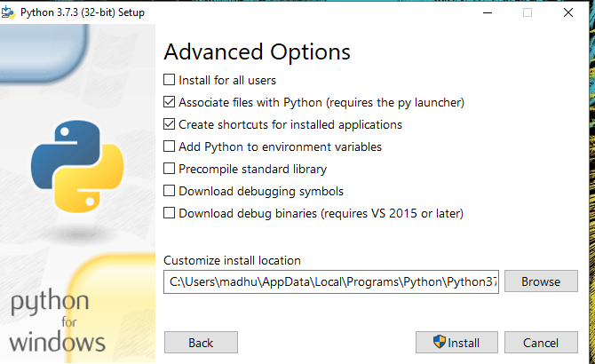

   5. Once the installation is over, you will see a **Python Setup Successful** window.

      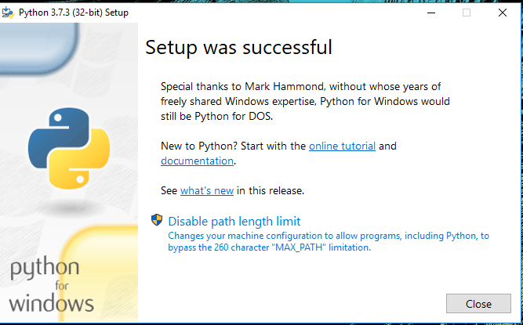

      #### Step 3: Add Python to environmental variables

      The last (optional) step in the installation process is to add Python Path to the System Environment variables. This step is done to access Python through the command line. In case you have added Python to environment variables while setting the Advanced options during the installation procedure, you can avoid this step. Else, this step is done manually as follows. In the Start menu, search for “advanced system settings”. Select “View advanced system settings”. In the “System Properties” window, click on the “Advanced” tab and then click on the “Environment Variables” button. Locate the Python installation directory on your system. If you followed the steps exactly as above, python will be installed in below locations:

      - C:\Program Files (x86)\Python37-32: for 32-bit installation
      - C:\Program Files\Python37-32: for 64-bit installation

      The folder name may be different from “Python37-32” if you installed a different version. Look for a folder whose name starts with Python. Append the following entries to PATH variable as shown below:

      

      

      #### Step 4: Verify the Python Installation

      You have now successfully installed Python 3.7.3 on Windows 10. You can verify if the Python installation is successful either through the command line or through the IDLE app that gets installed along with the installation. Search for the command prompt and type “python”. You can see that Python 3.7.3 is successfully installed.

      

      An alternate way to reach python is to search for “Python” in the start menu and clicking on IDLE (Python 3.7 64-bit). You can start coding in Python using the Integrated Development Environment(IDLE).

   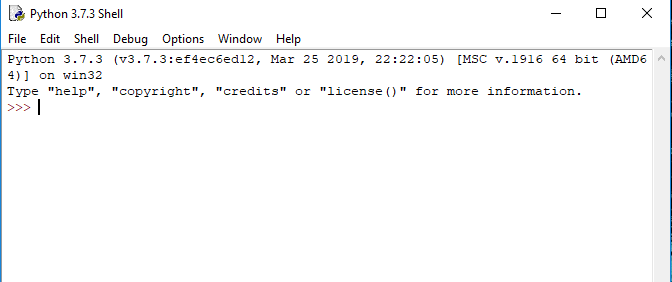

   Hurray! You are ready to start developing Python applications in your Windows 10 system.


### II. For macOS Users[^2]

I have two pieces of news for you; one is good, the other bad. The good news is that for the sake of compatibility with legacy systems, Python 2.7 is pre-installed on your Mac, but the bad news is that Python 2.7 has been retired. Therefore, it isn’t recommended for new developments. So, if you want to take advantage of the new Python version with its many features and improvements, you need to install the latest Python alongside the version that comes pre-installed on macOS. Before we start installing the latest version of Python, let’s see why there are different versions of the same programming language. All programming languages evolve by adding new features over time. The programming language developers announce these changes and improvements by increasing the version number.

Downloading the latest Python version from the official Python website (python.org) is the most common (and recommended) method for installing Python on a Mac. Let’s try it out.

1. First, download an installer package from the Python website. To do that, visit https://www.python.org/downloads/ on your Mac; it detects your operating system automatically and shows a big button for downloading the latest version of Python installer on your Mac. If it doesn’t, click the macOS link and choose the latest Python release.

   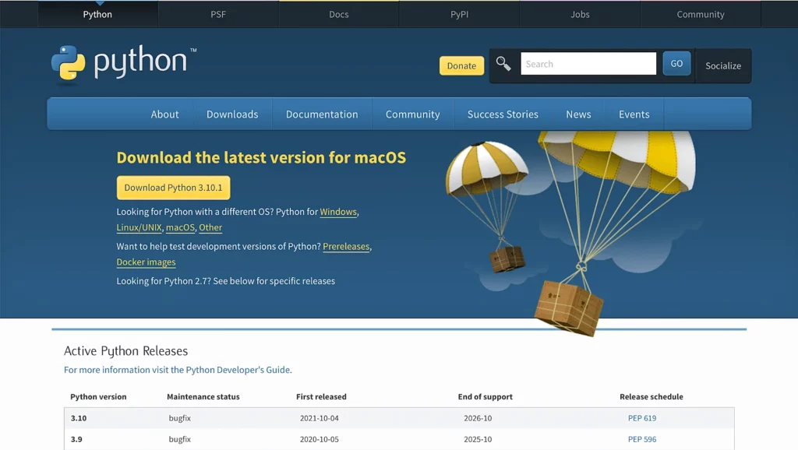


2. Once the download is complete, double-click the package to start installing Python. The installer will walk you through a wizard to complete the installation, and in most cases, the default settings work well, so install it like the other applications on macOS. You may also have to enter your Mac password to let it know that you agree with installing Python.

   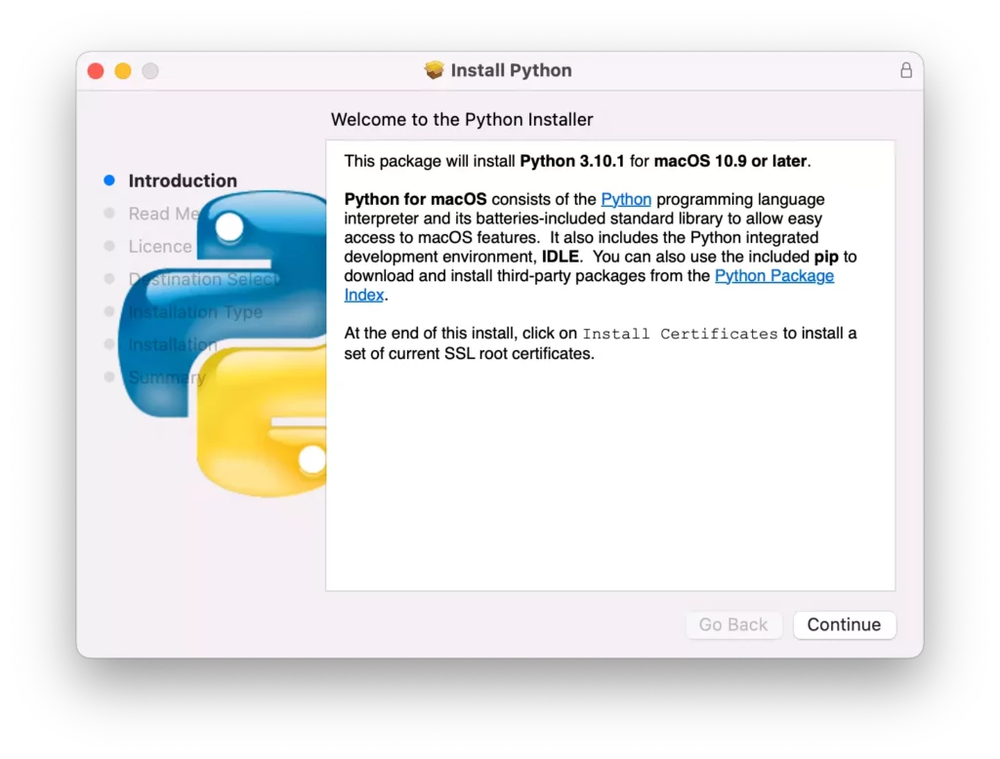

   **<u>*NOTE: If you’re using Apple M1 Mac, you need to install Rosetta. Rosetta enables Intel-based features to run on Apple silicon Macs.*</u>**

   3. When the installation completes, it will open up the Python folder.

      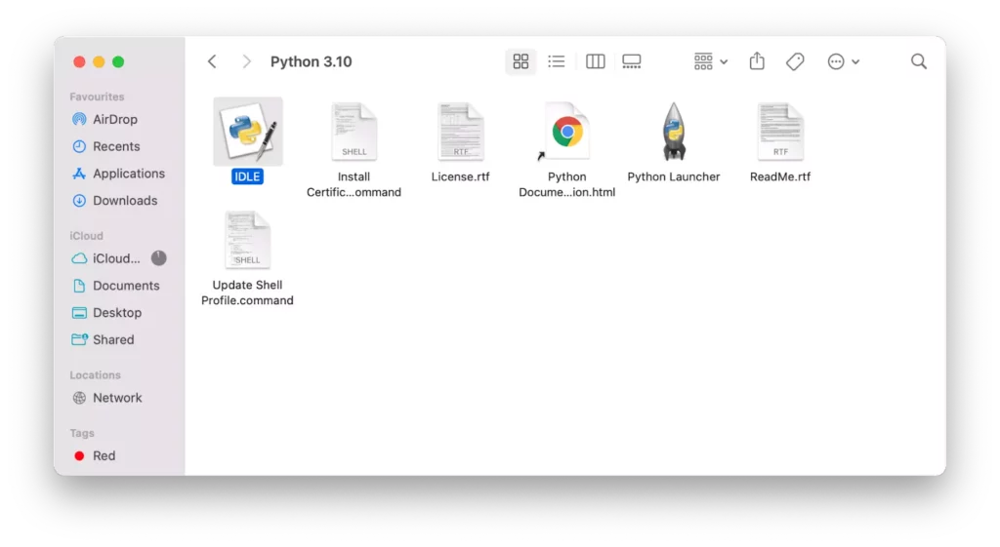

   4. Let’s verify that the latest version of Python and IDLE installed correctly. To do that, double-click IDLE, which is the integrated development environment shipped with Python. If everything works correctly, IDLE shows the Python shell as follows:

      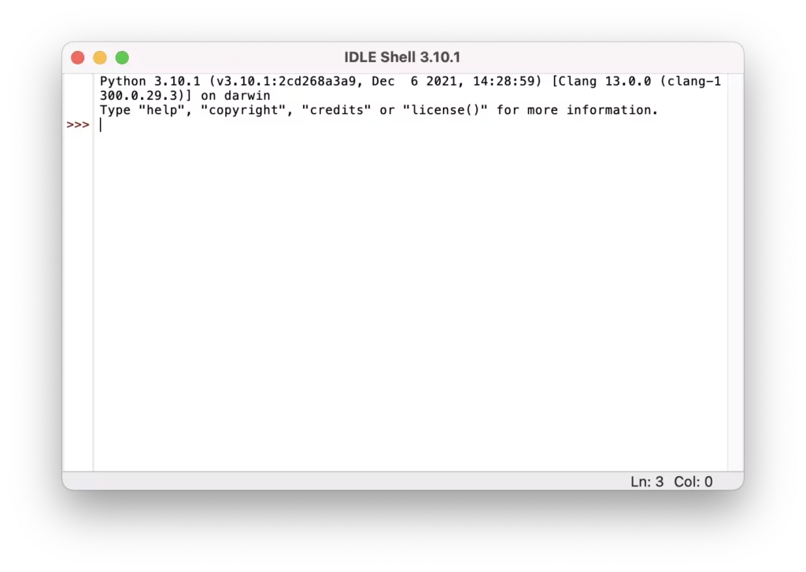


## Part 2: Getting Started with Python in VS Code[^3]

In this tutorial, you use Python 3 to create the simplest Python "Hello World" application in Visual Studio Code. By using the Python extension, you make VS Code into a great lightweight Python IDE (which you may find a productive alternative to PyCharm).

This tutorial introduces you to VS Code as a Python environment, primarily how to edit, run, and debug code through the following tasks:

- Write, run, and debug a Python "Hello World" Application
- Learn how to install packages by creating Python virtual environments
- Write a simple Python script to plot figures within VS Code

This tutorial is not intended to teach you Python itself. Once you are familiar with the basics of VS Code, you can then follow any of the [programming tutorials on python.org](https://wiki.python.org/moin/BeginnersGuide/Programmers) within the context of VS Code for an introduction to the language.

If you have any problems, feel free to file an issue for this tutorial in the [VS Code documentation repository](https://github.com/microsoft/vscode-docs/issues).

#### Prerequisites

To successfully complete this tutorial, you need to first setup your Python development environment. Specifically, this tutorial requires:

- Python 3
- VS Code application
- VS Code Python extension

#### Install Visual Studio Code and the Python Extension

1. If you have not already done so, install [VS Code](https://code.visualstudio.com/).

2. Next, install the [Python extension for VS Code](https://marketplace.visualstudio.com/items?itemName=ms-python.python) from the Visual Studio Marketplace. For additional details on installing extensions, see [Extension Marketplace](https://code.visualstudio.com/docs/editor/extension-marketplace). The Python extension is named **Python** and it's published by Microsoft.

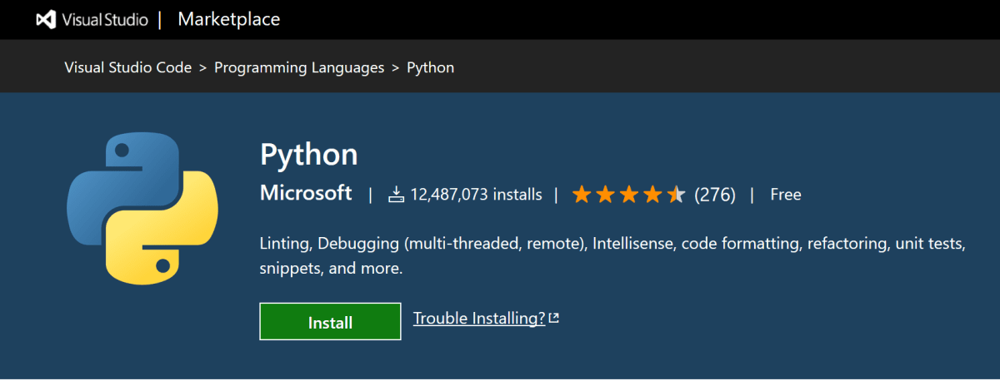

##### Install Studio Code

Visual Studio Code is a powerful open-source code editor developed by Microsoft. It has built-in debugging support, embedded Git control, syntax highlighting, code completion, integrated terminal, code refactoring, and snippets. Visual Studio Code is cross-platform, available on Windows, Linux, and macOS.

In this section, we’ll discuss how to download and install the VS Code on Windows.

**Step 1:** First of all, we need to download the installer file for Windows operating system. For that visit code.visualstudio.com and download the windows version of Vustua Studio Code or click the download button below.

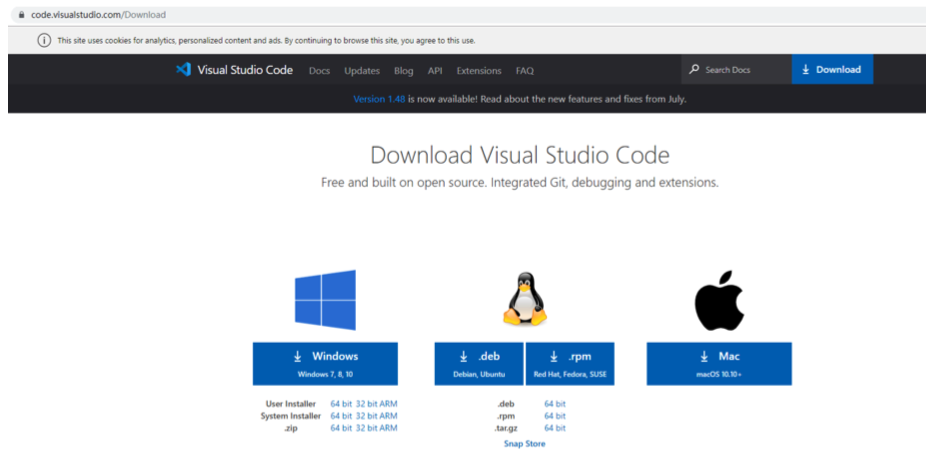

**Step 2:** After you have downloaded the installer file open it and accept the licence agreement then click on “Next“.


**Step 3:** Now select your installation location, where you want to install Visual Studio Code. If you don’t have any good reason to change the installation location then keep it to default.

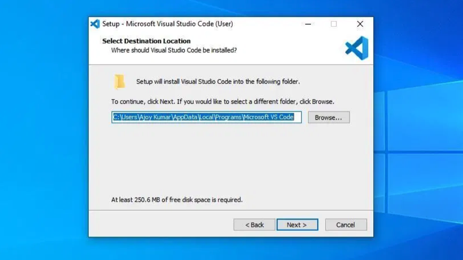

**Step 4:** After that select Start Menu Folder and add some additional tasks, “create a desktop icon” and “Add to Path“.

**<u>*Note: It is very important to add Visual Studio Code to PATH.*</u>**

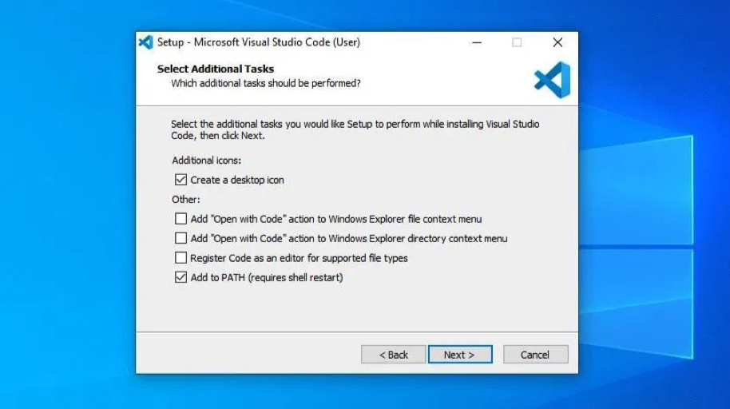

**<u>*Step 5:*</u>** Finally you are ready to install the VS Code on Windows 10. Just review all your selections then click on “Install”.

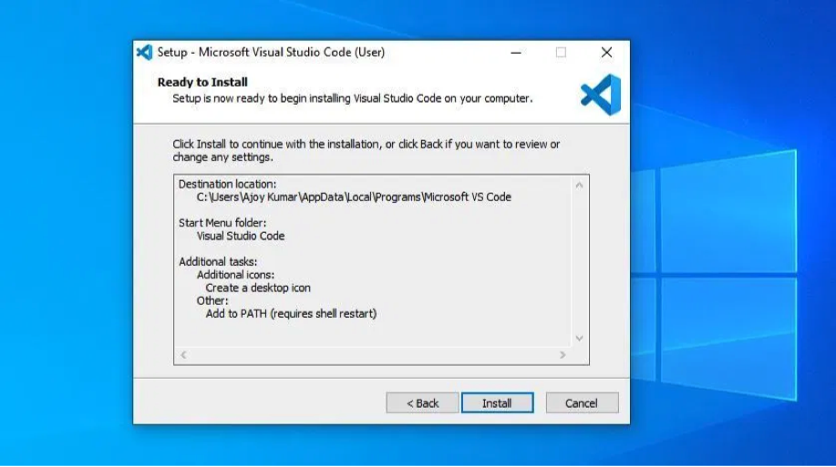

It will take some time to install so wait until the installation completed. After that, you’re ready to use to Visual Studio Code.

##### Python Extension for VS Code

To install extensions from within Visual Studio Code:

1. Click on Extensions icon , search the extension you want to install. (If you know the name or part of the name of the extension, you can search in the Search window.)
2. Select the extension, review its Details, contributions, changelog and more.
3. Finally when you’re ready to install the extension click on the “Install Button”.

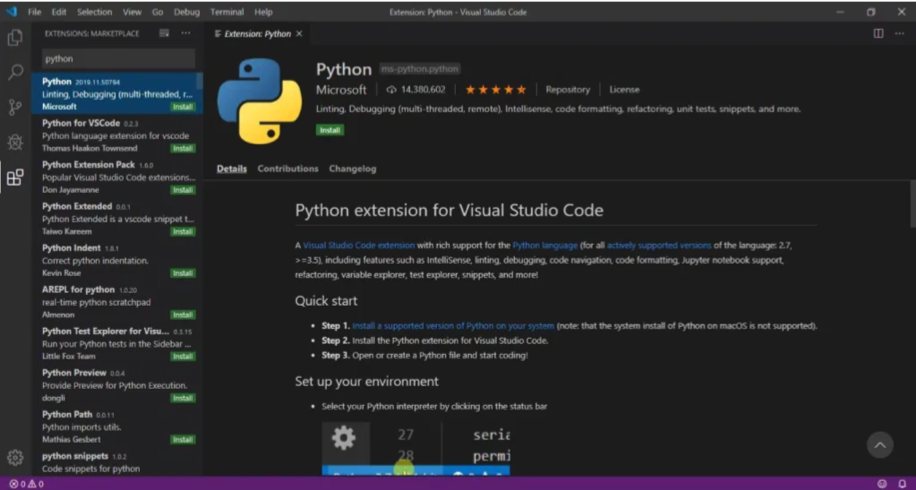

After installation complete reopen the Visual Studio Code.

#### Verify the Python installation

To verify that you've installed Python successfully on your machine, run one of the following commands (depending on your operating system):

- Linux/macOS: open a Terminal Window and type the following command:

  ```
  python3 --version
  ```

- Windows: open a command prompt and run the following command:

  ```
  py -3 --version
  ```

If the installation was successful, the output window should show the version of Python that you installed.

> **Note** You can use the `py -0` command in the VS Code integrated terminal to view the versions of python installed on your machine. The default interpreter is identified by an asterisk (*).

#### Start VS Code in a project (workspace) folder

Using a command prompt or terminal, create an empty folder called "hello", navigate into it, and open VS Code (`code`) in that folder (`.`) by entering the following commands:

```
mkdir hello
cd hello
code .
```

> **Note**: If you're using an Anaconda distribution, be sure to use an Anaconda command prompt.

By starting VS Code in a folder, that folder becomes your "workspace". VS Code stores settings that are specific to that workspace in `.vscode/settings.json`, which are separate from user settings that are stored globally.

Alternately, you can run VS Code through the operating system UI, then use **File > Open Folder** to open the project folder.

#### Select a Python interpreter

Python is an interpreted language, and in order to run Python code and get Python IntelliSense, you must tell VS Code which interpreter to use.

From within VS Code, select a Python 3 interpreter by opening the **Command Palette** (⇧⌘P), start typing the **Python: Select Interpreter** command to search, then select the command. You can also use the **Select Python Environment** option on the Status Bar if available (it may already show a selected interpreter, too):


The command presents a list of available interpreters that VS Code can find automatically, including virtual environments. If you don't see the desired interpreter, see [Configuring Python environments](https://code.visualstudio.com/docs/python/environments).

> **Note**: When using an Anaconda distribution, the correct interpreter should have the suffix `('base':conda)`, for example `Python 3.7.3 64-bit ('base':conda)`.

Selecting an interpreter sets which interpreter will be used by the Python extension for that workspace.

> **Note**: If you select an interpreter without a workspace folder open, VS Code sets `python.defaultInterpreterPath` in User scope instead, which sets the default interpreter for VS Code in general. The user setting makes sure you always have a default interpreter for Python projects. The workspace settings lets you override the user setting.

#### Create a Python Hello World source code file

From the File Explorer toolbar, select the **New File** button on the `hello` folder:


Name the file `hello.py`, and it automatically opens in the editor:


By using the `.py` file extension, you tell VS Code to interpret this file as a Python program, so that it evaluates the contents with the Python extension and the selected interpreter.

> **Note**: The File Explorer toolbar also allows you to create folders within your workspace to better organize your code. You can use the **New folder** button to quickly create a folder.

Now that you have a code file in your Workspace, enter the following source code in `hello.py`:

```
msg = "Hello World"
print(msg)
```

When you start typing `print`, notice how [IntelliSense](https://code.visualstudio.com/docs/editor/intellisense) presents auto-completion options.


IntelliSense and auto-completions work for standard Python modules as well as other packages you've installed into the environment of the selected Python interpreter. It also provides completions for methods available on object types. For example, because the `msg` variable contains a string, IntelliSense provides string methods when you type `msg.`:


Feel free to experiment with IntelliSense some more, but then revert your changes so you have only the `msg` variable and the `print` call, and save the file (⌘S).

For full details on editing, formatting, and refactoring, see [Editing code](https://code.visualstudio.com/docs/python/editing). The Python extension also has full support for [Linting](https://code.visualstudio.com/docs/python/linting).

#### Run Hello World

It's simple to run `hello.py` with Python. Just click the **Run Python File in Terminal** play button in the top-right side of the editor.


The button opens a terminal panel in which your Python interpreter is automatically activated, then runs `python3 hello.py` (macOS/Linux) or `python hello.py` (Windows):


There are three other ways you can run Python code within VS Code:

- Right-click anywhere in the editor window and select **Run Python File in Terminal** (which saves the file automatically):

  

- Select one or more lines, then press Shift+Enter or right-click and select **Run Selection/Line in Python Terminal**. This command is convenient for testing just a part of a file.

- From the Command Palette (⇧⌘P), select the **Python: Start REPL** command to open a REPL terminal for the currently selected Python interpreter. In the REPL, you can then enter and run lines of code one at a time.

#### Configure and run the debugger

Let's now try debugging our simple Hello World program.

First, set a breakpoint on line 2 of `hello.py` by placing the cursor on the `print` call and pressing F9. Alternately, just click in the editor's left gutter, next to the line numbers. When you set a breakpoint, a red circle appears in the gutter.


Next, to initialize the debugger, press F5. Since this is your first time debugging this file, a configuration menu will open from the Command Palette allowing you to select the type of debug configuration you would like for the opened file.


**Note**: VS Code uses JSON files for all of its various configurations; `launch.json` is the standard name for a file containing debugging configurations.

These different configurations are fully explained in [Debugging configurations](https://code.visualstudio.com/docs/python/debugging); for now, just select **Python File**, which is the configuration that runs the current file shown in the editor using the currently selected Python interpreter.

You can also start the debugger by clicking on the down-arrow next to the run button on the editor, and selecting **Debug Python File in Terminal**.


The debugger will stop at the first line of the file breakpoint. The current line is indicated with a yellow arrow in the left margin. If you examine the **Local** variables window at this point, you will see now defined `msg` variable appears in the **Local** pane.


A debug toolbar appears along the top with the following commands from left to right: continue (F5), step over (F10), step into (F11), step out (⇧F11), restart (⇧⌘F5), and stop (⇧F5).


The Status Bar also changes color (orange in many themes) to indicate that you're in debug mode. The **Python Debug Console** also appears automatically in the lower right panel to show the commands being run, along with the program output.

To continue running the program, select the continue command on the debug toolbar (F5). The debugger runs the program to the end.

> **Tip** Debugging information can also be seen by hovering over code, such as variables. In the case of `msg`, hovering over the variable will display the string `Hello world` in a box above the variable.

You can also work with variables in the **Debug Console** (If you don't see it, select **Debug Console** in the lower right area of VS Code, or select it from the **...** menu.) Then try entering the following lines, one by one, at the **>** prompt at the bottom of the console:

```
msg
msg.capitalize()
msg.split()
```


Select the blue **Continue** button on the toolbar again (or press F5) to run the program to completion. "Hello World" appears in the **Python Debug Console** if you switch back to it, and VS Code exits debugging mode once the program is complete.

If you restart the debugger, the debugger again stops on the first breakpoint.

To stop running a program before it's complete, use the red square stop button on the debug toolbar (⇧F5), or use the **Run > Stop debugging** menu command.

For full details, see [Debugging configurations](https://code.visualstudio.com/docs/python/debugging), which includes notes on how to use a specific Python interpreter for debugging.

> **Tip: Use Logpoints instead of print statements**: Developers often litter source code with `print`statements to quickly inspect variables without necessarily stepping through each line of code in a debugger. In VS Code, you can instead use **Logpoints**. A Logpoint is like a breakpoint except that it logs a message to the console and doesn't stop the program. For more information, see [Logpoints](https://code.visualstudio.com/docs/editor/debugging#_logpoints)in the main VS Code debugging article.


#### Install and use packages

Let's now run an example that's a little more interesting. In Python, packages are how you obtain any number of useful code libraries, typically from [PyPI](https://pypi.org/). For this example, you use the `matplotlib` and `numpy` packages to create a graphical plot as is commonly done with data science. (Note that `matplotlib` cannot show graphs when running in the [Windows Subsystem for Linux](https://docs.microsoft.com/windows/wsl/about) as it lacks the necessary UI support.)

Return to the **Explorer** view (the top-most icon on the left side, which shows files), create a new file called `standardplot.py`, and paste in the following source code:

```
import matplotlib.pyplot as plt
import numpy as np

x = np.linspace(0, 20, 100)  # Create a list of evenly-spaced numbers over the range
plt.plot(x, np.sin(x))       # Plot the sine of each x point
plt.show()                   # Display the plot
```

> **Tip**: If you enter the above code by hand, you may find that auto-completions change the names after the `as` keywords when you press Enter at the end of a line. To avoid this, type a space, then Enter.

Next, try running the file in the debugger using the "Python: Current file" configuration as described in the last section.

Unless you're using an Anaconda distribution or have previously installed the `matplotlib` package, you should see the message, **"ModuleNotFoundError: No module named 'matplotlib'"**. Such a message indicates that the required package isn't available in your system.

To install the `matplotlib` package (which also installs `numpy` as a dependency), stop the debugger and use the Command Palette to run **Terminal: Create New Terminal** (⌃⇧`). This command opens a command prompt for your selected interpreter.

A best practice among Python developers is to avoid installing packages into a global interpreter environment. You instead use a project-specific `virtual environment` that contains a copy of a global interpreter. Once you activate that environment, any packages you then install are isolated from other environments. Such isolation reduces many complications that can arise from conflicting package versions. To create a *virtual environment* and install the required packages, enter the following commands as appropriate for your operating system:

> **Note**: For additional information about virtual environments, see [Environments](https://code.visualstudio.com/docs/python/environments#_creating-environments).

1. Create and activate the virtual environment

   > **Note**: When you create a new virtual environment, you should be prompted by VS Code to set it as the default for your workspace folder. If selected, the environment will automatically be activated when you open a new terminal.

   

   **For Windows**

   ```
   py -3 -m venv .venv
   .venv\scripts\activate
   ```

   If the activate command generates the message "Activate.ps1 is not digitally signed. You cannot run this script on the current system.", then you need to temporarily change the PowerShell execution policy to allow scripts to run (see [About Execution Policies](https://go.microsoft.com/fwlink/?LinkID=135170) in the PowerShell documentation):

   ```
   Set-ExecutionPolicy -ExecutionPolicy RemoteSigned -Scope Process
   ```

   **For macOS/Linux**

   ```
   python3 -m venv .venv
   source .venv/bin/activate
   ```

2. Select your new environment by using the **Python: Select Interpreter** command from the **Command Palette**.

3. Install the packages

   ```
   # Don't use with Anaconda distributions because they include matplotlib already.
   
   # macOS
   python3 -m pip install matplotlib
   
   # Windows (may require elevation)
   python -m pip install matplotlib
   
   # Linux (Debian)
   apt-get install python3-tk
   python3 -m pip install matplotlib
   ```

4. Rerun the program now (with or without the debugger) and after a few moments a plot window appears with the output:

   

5. Once you are finished, type `deactivate` in the terminal window to deactivate the virtual environment.

For additional examples of creating and activating a virtual environment and installing packages, see the [Django tutorial](https://code.visualstudio.com/docs/python/tutorial-django) and the [Flask tutorial](https://code.visualstudio.com/docs/python/tutorial-flask).


#### Next steps

You can configure VS Code to use any Python environment you have installed, including virtual and conda environments. You can also use a separate environment for debugging. For full details, see [Environments](https://code.visualstudio.com/docs/python/environments).

To learn more about the Python language, follow any of the [programming tutorials](https://wiki.python.org/moin/BeginnersGuide/Programmers) listed on python.org within the context of VS Code.

To learn to build web apps with the Django and Flask frameworks, see the following tutorials:

- [Use Django in Visual Studio Code](https://code.visualstudio.com/docs/python/tutorial-django)
- [Use Flask in Visual Studio Code](https://code.visualstudio.com/docs/python/tutorial-flask)

There is then much more to explore with Python in Visual Studio Code:

- [Editing code](https://code.visualstudio.com/docs/python/editing) - Learn about autocomplete, IntelliSense, formatting, and refactoring for Python.
- [Linting](https://code.visualstudio.com/docs/python/linting) - Enable, configure, and apply a variety of Python linters.
- [Debugging](https://code.visualstudio.com/docs/python/debugging) - Learn to debug Python both locally and remotely.
- [Testing](https://code.visualstudio.com/docs/python/testing) - Configure test environments and discover, run, and debug tests.
- [Settings reference](https://code.visualstudio.com/docs/python/settings-reference) - Explore the full range of Python-related settings in VS Code.
- [Deploy Python to Azure App Service using containers](https://docs.microsoft.com/azure/python/tutorial-deploy-containers-01)
- [Deploy Python to Azure App Service on Linux](https://docs.microsoft.com/azure/python/tutorial-deploy-app-service-on-linux-01)


## Part 3: Install pip

**PIP** is a package management system used to install and manage software packages/libraries written in Python. These files are stored in a large “online repository” termed as Python Package Index (PyPI). pip uses PyPI as the default source for packages and their dependencies. So whenever you type:

```
pip install package_name
```

pip will look for that package on PyPI and if found, it will download and install the package on your local system.

### 1. On Windows[^4]

Pip must be manually installed on Windows. You might need to use the correct version of the file from pypa.org if you’re using an earlier version of Python or pip. Get the file and save it to a folder on your PC.

**Step 1:** Download the **get-pip.py (https://bootstrap.pypa.io/get-pip.py)** file and store it in the same directory as python is installed.


 

**Step 2:** Change the current path of the directory in the command line to the path of the directory where the above file exists. 


 

**Step 3:** get-pip.py is a bootstrapping script that enables users to install pip in Python environments. Run the command given below:

```
python get-pip.py
```

**Step 4:** Now wait through the installation process. Voila! pip is now installed on your system.


 

#### Verification of the installation process

One can easily verify if the pip has been installed correctly by performing a version check on the same. Just go to the command line and execute the following command:

```
pip -V
or
pip --version
```


 

#### Adding PIP To Windows Environment Variables

If you are facing any path error then you can follow the following steps to add the pip to your PATH. You can follow the following steps to set the Path:

- Go to System and Security > System in the Control Panel once it has been opened.
- On the left side, click the Advanced system settings link.
- Then select Environment Variables.
- Double-click the PATH variable under System Variables.
- Click New, and add the directory where pip is installed, e.g. C:Python33Scripts, and select OK.

#### Upgrading Pip On Windows

pip can be upgraded using the following command.

```
python -m pip install -U pip
```


### 2. On macOS[^8]

pip can be downloaded and installed usingthe  command line by going through the following steps:

**Step 1:** Download the  get-pip.py(https://bootstrap.pypa.io/get-pip.py) file and store it in the same directory as python is installed. or Use the following command to download pip directly

```
curl https://bootstrap.pypa.io/get-pip.py -o get-pip.py
```

**Step 2:** Now execute the downloaded file using the below command

```
python3 get-pip.py
```

**Step 3:** Wait through the installation process. 


 

Voila! pip is now installed on your system.

#### Verification of the Installation process

One can easily verify if the pip has been installed correctly by performing a version check on the same. Just go to the command line and execute the following command:

```
pip3 --version
pip --version
```


#### How to Update PIP on a Mac

You can use the following command in your terminal to upgrade your pip. 

```
python3 -m pip install –upgrade pip
```


### 3. Configure pip to download from mirror site

By default, pip installs packages from its original server. However, we may come across poor conditions, when the original server does not work. Luckily, we can resolve this case by configuring pip with a local mirror site.

For example, use SUSTech mirror[^9].

```
pip install --upgrade pip --index-url https://mirrors.sustech.edu.cn/pypi/simple
pip config set global.index-url https://mirrors.sustech.edu.cn/pypi/simple
```

That's all.


## Part 4: Download and Install Anaconda

This tutorial will demonstrate how you can install Anaconda, a powerful package manager, on Microsoft Windows.

Anaconda is a package manager, an environment manager, and Python distribution that contains a collection of many open source packages. This is advantageous as when you are working on a data science project, you will find that you need many different packages (numpy, scikit-learn, scipy, pandas to name a few), which an installation of Anaconda comes preinstalled with. If you need additional packages after installing Anaconda, you can use Anaconda's package manager, conda, or pip to install those packages. This is highly advantageous as you don't have to manage dependencies between multiple packages yourself. Conda even makes it easy to switch between Python 2 and 3 (you can learn more [here](https://towardsdatascience.com/environment-management-with-conda-python-2-3-b9961a8a5097)). In fact, an installation of Anaconda is also the [recommended way to install Jupyter Notebooks](http://jupyter.org/install.html) which you can learn more about [here](https://www.datacamp.com/community/tutorials/tutorial-jupyter-notebook) on the DataCamp community.

This tutorial will include:

- [How to Install Anaconda on Windows](https://www.datacamp.com/tutorial/installing-anaconda-windows#install)
- [How to test your installation and fix common installation issues](https://www.datacamp.com/tutorial/installing-anaconda-windows#test)
- [What to do after installing Anaconda](https://www.datacamp.com/tutorial/installing-anaconda-windows#after)

With that, let's get started!

### Install Anaconda on Windows[^5]

1. Go to the [Anaconda Website](https://www.anaconda.com/download/#windows) and choose a Python 3.x graphical installer (A) or a Python 2.x graphical installer (B). If you aren't sure which Python version you want to install, choose Python 3. Do not choose both.


2. Locate your download and double click it.


When the screen below appears, click on Next.


3. Read the license agreement and click on I Agree.


4. Click on Next.


5. Note your installation location and then click Next.


6. This is an important part of the installation process. The recommended approach is to not check the box to add Anaconda to your path. This means you will have to use Anaconda Navigator or the Anaconda Command Prompt (located in the Start Menu under "Anaconda") when you wish to use Anaconda (you can always add Anaconda to your PATH later if you don't check the box). If you want to be able to use Anaconda in your command prompt (or git bash, [cmder](http://cmder.net/), powershell etc), please use the alternative approach and check the box.


 

7. Click on Next.


8. You can install Microsoft VSCode if you wish, but it is optional.


9. Click on Finish.


#### Add Anaconda to Path (Optional)

This is an **optional** step. This is for the case where you didn't check the box in step 6 and now want to add Anaconda to your Path. The advantage of this is that you will be able to use Anaconda in your Command Prompt, Git Bash, cmder etc.

 

1. Open a Command Prompt.


2. Check if you already have Anaconda added to your path. Enter the commands below into your Command Prompt. This is checking if you already have Anaconda added to your path. If you get a command **not recognized** error like in the left side of the image below, proceed to step 3. If you get an output similar to the right side of the image below, you have already added Anaconda to your path.

```javascript
conda --version

python --version

POWERED BY DATACAMP WORKSPACECOPY CODE
```


3. If you don't know where your conda and/or python is, open an **Anaconda Prompt** and type in the following commands. This is telling you where conda and python are located on your computer.

```javascript
where conda
where python

POWERED BY DATACAMP WORKSPACECOPY CODE
```


4. Add conda and python to your PATH. You can do this by going to your Environment Variables and adding the output of step 3 (enclosed in the red rectangle) to your path. If you are having issues, here is a short [video](https://youtu.be/mf5u2chPBjY?t=15m45s) on adding conda and python to your PATH.


5. Open a **new Command Prompt**. Try typing `conda --version` and `python --version` into the **Command Prompt** to check to see if everything went well.


### Install anaconda on macOS using Homebrew[^6]


Instead of spend time for hours to setup an environment and install hundred of dependencies for Data Science work, we must spend time on the work instead of setup right?

That’s why we need [anaconda](https://www.anaconda.com/). In this blog, I’ll demonstrate how easy to install anaconda with brew step by step.


> Anaconda Distribution
>
> The World’s Most Popular Python/R Data Science Platform
>
> The open-source [Anaconda Distribution](https://docs.anaconda.com/anaconda/) is the easiest way to perform Python/R data science and machine learning on Linux, Windows, and Mac OS X. With over 11 million users worldwide, it is the industry standard for developing, testing, and training on a single machine, enabling *individual data scientists* to:

#### Contents

1. Download homebrew.
2. Install package via homebrew.
3. Setup the environment path.

#### Download homebrew and zsh

I recommended you to download homebrew and zsh, if you’re not familiar with this go to read [this blog](https://medium.com/ayuth/iterm2-zsh-oh-my-zsh-the-most-power-full-of-terminal-on-macos-bdb2823fb04c) before continue reading this blog.

#### Install anaconda via homebrew

1. Install anaconda via `brew cask` by executing

```
➜ brew install --cask anaconda.
.
.
PREFIX=/usr/local/anaconda3
.
.
.🍺  anaconda was successfully installed!
```

#### Let’s run jupyter notebook

Try to executing `jupyter notebook` in your terminal.

It’s not works … why? Because our shell doesn’t know where is the anaconda folder so is, let’s add that folder to our shell path.

#### Setup the environment path.

Insert a line below on top of your `~/.zshrc` file because when you trying to execute `python` on terminal it’ll search on folder `/usr/local/anaconda3/bin` first before search on default operating system path which means you can execute `jupyter notebook` and `python` .

```
export PATH="/usr/local/anaconda3/bin:$PATH"
```

Restart terminal or use `source ~/.zshrc` to reload your shell environment and execute `jupyter notebook` an output will be like this


## Part 5: Install Jupyter Notebook in Anaconda[^7]

#### 1. Open Anaconda Navigator

Open Anaconda Navigator from windows start or by searching it. Anaconda Navigator is a UI application where you can control the Anaconda packages, environment e.t.c


#### 2. Create an Environment to Run Jupyter Notebook

This is optional but recommended to create an environment before you proceed. This gives complete segregation of different package installs for different projects you would be working on. If you already have an environment, you can use it too.


select + Create icon at the bottom of the screen to create an Anaconda environment.


#### 3. Install and Run Jupyter Notebook

Once you create the anaconda environment, go back to the Home page on Anaconda Navigator and install Jupyter Notebook from an application on the right panel.


It will take a few seconds to install Jupyter to your environment, once the install completes, you can open Jupyter from the same screen or by accessing **Anaconda Navigator** -> **Environments** -> **your environment** (mine pandas-tutorial) -> select **Open With Jupyter Notebook**.


This opens up Jupyter Notebook in the default browser.


Now select **New** -> **PythonX** and enter the below lines and select **Run**. On Jupyter, each cell is a statement, so you can run each cell independently when there are no dependencies on previous cells.


This completes installing Anaconda and running Jupyter Notebook. I have tried my best to layout step-by-step instructions, In case I miss any or If you have any issues installing, please comment below. Your comments might help others.


## Part 6: Jupyter Notebooks in VS Code[^10]

[Jupyter](https://jupyter-notebook.readthedocs.io/en/latest/) (formerly IPython Notebook) is an open-source project that lets you easily combine Markdown text and executable Python source code on one canvas called a **notebook**. Visual Studio Code supports working with Jupyter Notebooks natively, and through [Python code files](https://code.visualstudio.com/docs/python/jupyter-support-py). This topic covers the native support available for Jupyter Notebooks and demonstrates how to:

- Create, open, and save Jupyter Notebooks
- Work with Jupyter code cells
- View, inspect, and filter variables using the Variable Explorer and Data Viewer
- Connect to a remote Jupyter server
- Debug a Jupyter Notebook

### Setting up your environment[#](https://code.visualstudio.com/docs/datascience/jupyter-notebooks#_setting-up-your-environment)

To work with Python in Jupyter Notebooks, you must activate an Anaconda environment in VS Code, or another Python environment in which you've installed the [Jupyter package](https://pypi.org/project/jupyter/). To select an environment, use the **Python: Select Interpreter** command from the Command Palette (⇧⌘P).

Once the appropriate environment is activated, you can create and open a Jupyter Notebook, connect to a remote Jupyter server for running code cells, and export a Jupyter Notebook as a Python file.

### Workspace Trust[#](https://code.visualstudio.com/docs/datascience/jupyter-notebooks#_workspace-trust)

When getting started with Notebooks, you'll want to make sure that you are working in a trusted workspace. Harmful code can be embedded in notebooks and the [Workspace Trust](https://code.visualstudio.com/docs/editor/workspace-trust) feature allows you to indicate which folders and their contents should allow or restrict automatic code execution.

If you attempt to open a notebook when VS Code is in an untrusted workspace running [Restricted Mode](https://code.visualstudio.com/docs/editor/workspace-trust#_restricted-mode), you will not be able to execute cells and rich outputs will be hidden.

### Create or open a Jupyter Notebook[#](https://code.visualstudio.com/docs/datascience/jupyter-notebooks#_create-or-open-a-jupyter-notebook)

You can create a Jupyter Notebook by running the **Jupyter: Create New Jupyter Notebook** command from the Command Palette (⇧⌘P) or by creating a new `.ipynb` file in your workspace.


Next, select a kernel using the kernel picker in the top right.


After selecting a kernel, the language picker located in the bottom right of each code cell will automatically update to the language supported by the kernel.


If you have an existing Jupyter Notebook, you can open it by right-clicking on the file and opening with VS Code, or through the VS Code File Explorer.

### Running cells[#](https://code.visualstudio.com/docs/datascience/jupyter-notebooks#_running-cells)

Once you have a Notebook, you can run a code cell using the **Run** icon to the left of the cell and the output will appear directly below the code cell.

You can also use keyboard shortcuts to run code. When in command or edit mode, use Ctrl+Enter to run the current cell or Shift+Enter to run the current cell and advance to the next.


You can run multiple cells by selecting **Run All**, **Run All Above**, or **Run All Below**.


### Save your Jupyter Notebook[#](https://code.visualstudio.com/docs/datascience/jupyter-notebooks#_save-your-jupyter-notebook)

You can save your Jupyter Notebook using the keyboard shortcut Ctrl+S or **File** > **Save**.

### Export your Jupyter Notebook[#](https://code.visualstudio.com/docs/datascience/jupyter-notebooks#_export-your-jupyter-notebook)

You can export a Jupyter Notebook as a Python file (`.py`), a PDF, or an HTML file. To export, select the **Export** action on the main toolbar. You'll then be presented with a dropdown of file format options.


> **Note:** For PDF export, you must have [TeX installed](https://nbconvert.readthedocs.io/en/latest/install.html#installing-tex). If you don't, you will be notified that you need to install it when you select the PDF option. Also, be aware that if you have SVG-only output in your Notebook, they will not be displayed in the PDF. To have SVG graphics in a PDF, either ensure that your output includes a non-SVG image format or else you can first export to HTML and then save as PDF using your browser.

### Work with code cells in the Notebook Editor[#](https://code.visualstudio.com/docs/datascience/jupyter-notebooks#_work-with-code-cells-in-the-notebook-editor)

The Notebook Editor makes it easy to create, edit, and run code cells within your Jupyter Notebook.

#### Create a code cell[#](https://code.visualstudio.com/docs/datascience/jupyter-notebooks#_create-a-code-cell)

By default, a blank Notebook will have an empty code cell for you to start with and an existing Notebook will place one at the bottom. Add your code to the empty code cell to get started.

```
msg = "Hello world"
print(msg)
```


#### Code cell modes[#](https://code.visualstudio.com/docs/datascience/jupyter-notebooks#_code-cell-modes)

While working with code cells, a cell can be in three states: unselected, command mode, and edit mode. The current state of a cell is indicated by a vertical bar to the left of a code cell and editor border. When no bar is visible, the cell is unselected.


When a cell is selected, it can be in two different modes. It can be in command mode or in edit mode. When the cell is in command mode, it can be operated on and accept keyboard commands. When the cell is in edit mode, the cell's contents (code or Markdown) can be modified.

When a cell is in command mode, a solid vertical bar will appear to the left of the cell.


When you're in edit mode, the solid vertical bar is joined by a border around the cell editor.


To move from edit mode to command mode, press the Esc key. To move from command mode to edit mode, press the Enter key. You can also use the mouse to **change the mode** by clicking the vertical bar to the left of the cell or out of the code/Markdown region in the code cell.

#### Add additional code cells[#](https://code.visualstudio.com/docs/datascience/jupyter-notebooks#_add-additional-code-cells)

Code cells can be added to a Notebook using the main toolbar, a cell's add cell toolbar (visible with hover), and through keyboard commands.


Using the plus icons in the main toolbar and a cell's hover toolbar will add a new cell directly below the currently selected cell.

When a code cell is in command mode, the A key can be used to add a cell above and the B can be used to add a cell below the selected cell.

#### Select a code cell[#](https://code.visualstudio.com/docs/datascience/jupyter-notebooks#_select-a-code-cell)

The selected code cell can be changed using the mouse, the up/down arrow keys on the keyboard, and the J (down) and K (up) keys. To use the keyboard, the cell must be in command mode.

#### Select multiple code cells[#](https://code.visualstudio.com/docs/datascience/jupyter-notebooks#_select-multiple-code-cells)

To select multiple cells, start with one cell in selected mode. If you want to select consecutive cells, hold down Shift and click the last cell you want to select. If you want to select any group of cells, hold down Ctrl and click the cells you'd like to add to your selection.

Selected cells will be indicated by the filled background.


#### Run a single code cell[#](https://code.visualstudio.com/docs/datascience/jupyter-notebooks#_run-a-single-code-cell)

Once your code is added, you can run a cell using the **Run** icon to the left of the cell and the output will be displayed below the code cell.


You can also use keyboard shortcuts to run a selected code cell. Ctrl+Enter runs the currently selected cell, Shift+Enter runs the currently selected cell and inserts a new cell immediately below (focus moves to new cell), and Alt+Enter runs the currently selected cell and inserts a new cell immediately below (focus remains on current cell). These keyboard shortcuts can be used in both command and edit modes.

#### Run multiple code cells[#](https://code.visualstudio.com/docs/datascience/jupyter-notebooks#_run-multiple-code-cells)

Running multiple code cells can be accomplished in many ways. You can use the double arrow in the main toolbar of the Notebook Editor to run all cells within the Notebook or the **Run** icons with directional arrows in the cell toolbar to run all cells above or below the current code cell.


#### Move a code cell[#](https://code.visualstudio.com/docs/datascience/jupyter-notebooks#_move-a-code-cell)

Moving cells up or down within a notebook can be accomplished via dragging and dropping. For code cells, the drag and drop area is to the left of the cell editor as indicated below. For rendered Markdown cells, you may click anywhere to drag and drop cells.


To move multiple cells, you can use the same drag and drop areas in any cell included in the selection.

You can also use the keyboard shortcuts Alt+Arrow to move one or multiple selected cells.

#### Delete a code cell[#](https://code.visualstudio.com/docs/datascience/jupyter-notebooks#_delete-a-code-cell)

Deleting a code cell can be accomplished by using the **Delete** icon in the code cell toolbar or through the keyboard shortcut dd when the selected code cell is in command mode.


#### Undo your last change[#](https://code.visualstudio.com/docs/datascience/jupyter-notebooks#_undo-your-last-change)

You can use the z key to undo your previous change, for example, if you've made an accidental edit, you can undo it to the previous correct state, or if you've deleted a cell accidentally, you can recover it.

#### Switch between code and Markdown[#](https://code.visualstudio.com/docs/datascience/jupyter-notebooks#_switch-between-code-and-markdown)

The Notebook Editor allows you to easily change code cells between Markdown and code. Selecting the language picker in the bottom right of a cell will allow you to switch between Markdown and, if applicable, any other language supported by the selected kernel.


You can also use the keyboard to change the cell type. When a cell is selected and in command mode, the M key switches the cell type to Markdown and the Y key switches the cell type to code.

Once Markdown is set, you can enter Markdown formatted content to the code cell.


To render Markdown cells, you can select the check mark in the cell toolbar, or use the Ctrl+Enter and Shift+Enter keyboard shortcuts.


#### Clear output or restart/interrupt the kernel[#](https://code.visualstudio.com/docs/datascience/jupyter-notebooks#_clear-output-or-restartinterrupt-the-kernel)

If you'd like to clear all code cell outputs or restart/interrupt the kernel, you can accomplish that using the main Notebook Editor toolbar.


#### Enable/disable line numbers[#](https://code.visualstudio.com/docs/datascience/jupyter-notebooks#_enabledisable-line-numbers)

When you are in command mode, you can enable or disable line numbering within a single code cell by using the L key.


To toggle line numbering for the entire notebook, use Shift+L when in command mode on any cell.


### Table of Contents[#](https://code.visualstudio.com/docs/datascience/jupyter-notebooks#_table-of-contents)

To navigate through your notebook, open the File Explorer in the Activity bar. Then open the **Outline** tab in the Side bar.


> **Note:** By default, the outline will only show Markdown. To show code cells, enable the following setting: **Notebook > Outline: Show Code Cells**.

### IntelliSense support in the Jupyter Notebook Editor[#](https://code.visualstudio.com/docs/datascience/jupyter-notebooks#_intellisense-support-in-the-jupyter-notebook-editor)

The Python Jupyter Notebook Editor window has full IntelliSense – code completions, member lists, quick info for methods, and parameter hints. You can be just as productive typing in the Notebook Editor window as you are in the code editor.


### Variable Explorer and Data Viewer[#](https://code.visualstudio.com/docs/datascience/jupyter-notebooks#_variable-explorer-and-data-viewer)

Within a Python Notebook, it's possible to view, inspect, sort, and filter the variables within your current Jupyter session. By selecting the **Variables** icon in the main toolbar after running code and cells, you'll see a list of the current variables, which will automatically update as variables are used in code. The variables pane will open at the bottom of the notebook.


#### Data Viewer[#](https://code.visualstudio.com/docs/datascience/jupyter-notebooks#_data-viewer)

For additional information about your variables, you can also double-click on a row or use the **Show variable in data viewer** button next to the variable for a more detailed view of a variable in the Data Viewer.


#### Filtering rows[#](https://code.visualstudio.com/docs/datascience/jupyter-notebooks#_filtering-rows)

Filtering rows in the data viewer can be done by typing in the textbox at the top of each column. Type a string you want to search for and any row that has that string in the column will be found:


If you want to find an exact match, prefix your filter with '=':


More complex filtering can be done by typing a [regular expression](https://developer.mozilla.org/en-US/docs/Web/JavaScript/Guide/Regular_Expressions):


### Saving plots[#](https://code.visualstudio.com/docs/datascience/jupyter-notebooks#_saving-plots)

To save a plot from your notebook, simply hover over the output and select the **Save** icon in the top right.


> **Note:** There is support for rendering plots created with [matplotlib](https://matplotlib.org/) and [Altair](https://altair-viz.github.io/index.html).

### Custom notebook diffing[#](https://code.visualstudio.com/docs/datascience/jupyter-notebooks#_custom-notebook-diffing)

Under the hood, Jupyter Notebooks are JSON files. The segments in a JSON file are rendered as cells that are comprised of three components: input, output, and metadata. Comparing changes made in a notebook using lined-based diffing is difficult and hard to parse. The rich diffing editor for notebooks allows you to easily see changes for each component of a cell.

You can even customize what types of changes you want displayed within your diffing view. In the top right, select the overflow menu item in the toolbar to customize what cell components you want included. Input differences will always be shown.


To learn more about Git integration within VS Code, visit [Version Control in VS Code](https://code.visualstudio.com/docs/editor/versioncontrol).

### Debug a Jupyter Notebook[#](https://code.visualstudio.com/docs/datascience/jupyter-notebooks#_debug-a-jupyter-notebook)

There are two different ways to debug a Jupyter notebook: a simpler mode called "Run by Line", and full debugging mode.

> **Note:** Both of these features require ipykernel 6+. See [this wiki page](https://github.com/microsoft/vscode-jupyter/wiki/Setting-Up-Run-by-Line-and-Debugging-for-Notebooks) for details about installing or upgrading ipykernel.

#### Run by Line[#](https://code.visualstudio.com/docs/datascience/jupyter-notebooks#_run-by-line)

Run by Line lets you execute a cell one line at a time, without being distracted by other VS Code debug features. To start, select the **Run by Line** button in the cell toolbar:


Use the same button to advance by one statement. You can select the cell **Stop** button to stop early, or the **Continue** button in the toolbar to continue running to the end of the cell.

#### Debug Cell[#](https://code.visualstudio.com/docs/datascience/jupyter-notebooks#_debug-cell)

If you want to use the full set of debugging features supported in VS Code, such as breakpoints and the ability to step in to other cells and modules, you can use the full VS Code debugger.

1. Start by setting any breakpoints you need by clicking in the left margin of a notebook cell.
2. Then select the **Debug Cell** button in the menu next to the **Run** button. This will run the cell in a debug session, and will pause on your breakpoints in any code that runs, even if it is in a different cell or a `.py` file.
3. You can use the Debug view, Debug Console, and all the buttons in the Debug Toolbar as you normally would in VS Code.


### Connect to a remote Jupyter server[#](https://code.visualstudio.com/docs/datascience/jupyter-notebooks#_connect-to-a-remote-jupyter-server)

You can offload intensive computation in a Jupyter Notebook to other computers by connecting to a remote Jupyter server. Once connected, code cells run on the remote server rather than the local computer.

To connect to a remote Jupyter server:

1. Select the **Jupyter Server: local** button in the global Status bar or run the **Jupyter: Specify local or remote Jupyter server for connections** command from the Command Palette (⇧⌘P).

   

2. When prompted to **Pick how to connect to Jupyter**, select **Existing: Specify the URI of an existing server**.

   

3. When prompted to **Enter the URI of a Jupyter server**, provide the server's URI (hostname) with the authentication token included with a `?token=` URL parameter. (If you start the server in the VS Code terminal with an authentication token enabled, the URL with the token typically appears in the terminal output from where you can copy it.) Alternatively, you can specify a username and password after providing the URI.

   

> **Note:** For added security, Microsoft recommends configuring your Jupyter server with security precautions such as SSL and token support. This helps ensure that requests sent to the Jupyter server are authenticated and connections to the remote server are encrypted. For guidance about securing a notebook server, refer to the [Jupyter documentation](https://jupyter-notebook.readthedocs.io/en/stable/public_server.html#securing-a-notebook-server).


[^1]: https://www.digitalocean.com/community/tutorials/install-python-windows-10
[^2]: https://www.dataquest.io/blog/installing-python-on-mac/
[^3]: https://code.visualstudio.com/docs/python/python-tutorial
[^4]: https://www.geeksforgeeks.org/how-to-install-pip-on-windows/
[^5]: https://www.datacamp.com/tutorial/installing-anaconda-windows#test
[^6]: https://medium.com/ayuth/install-anaconda-on-macos-with-homebrew-c94437d63a37
[^7]: https://sparkbyexamples.com/python/install-anaconda-jupyter-notebook/
[^8]: https://www.geeksforgeeks.org/how-to-install-pip-in-macos/
[^9]: https://mirrors.sustech.edu.cn/help/pypi.html#introduction
[^10]: https://code.visualstudio.com/docs/datascience/jupyter-notebooks

