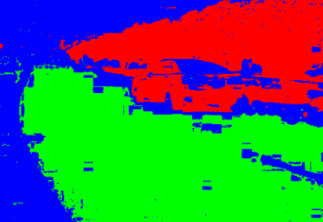

# Lab 10 - Clustering with GMM

## I. Introduce

Gaussian mixture model (GMM) based clustering is similar to k-means based clustering but more generalized for various applications. Its formula is following:
$$
p(\bold{x}) = \sum_{k=1}^K\pi_k\mathcal{N}(\bold{x}|\pmb{\mu}_k,\pmb\Sigma_k)
\\
\left\{
\begin{aligned}
&\pi: \text{mixing coefficient}\\
&\pmb{\mu}: \text{means}\\
&\pmb{\Sigma}: \text{covariance matrix}
\end{aligned}
\right.
$$


In this lab, our goal is to write a program to segment different objects using the **GMM and EM** algorithm. We also use <u>*k-means* clustering algorithm to initialize the parameters</u> of GMM. The following steps should be implemented to achieve such a goal:

1. Load image
2. Initialize parameters of GMM using K-means
3. Implement the EM algorithm for GMM
4. Display result

## II. Lab Practice 

```python
# Dependency
import numpy as np
from scipy.stats import multivariate_normal
from sklearn.cluster import KMeans
import tqdm
import utils
```

### (1) Load Image

We use `load_image()` in `utils.py` and `load()` in `segmentation_GMM.py` to load a image which isn't the point of our lab so we don't elaborate it here. 

What you should do is to implement Z-score normalization in `load()`:

```python
def load(image_path):
    ...

    # TODO: please normalize image_pixl using Z-score
    _mean = None
    _std = None
    image_norm = None

    ...
    return h, w, c, image_norm
```

### (2) K-means

GMM needs initial means, covariance matrices and mixing coefficients. We use K-means to do that. This time we leverage `sklearn` to implement it.

```python
kmeans = KMeans(n_clusters=n_cluster)  # instantiate a K-means
labels = kmeans.fit_predict(image_pixl)  # fit and get clustering result
initial_mus = kmeans.cluster_centers_  # get centroids
```

Followings are for initialization:

```python
for i in range(n_cluster):
    datas = image_pixl[labels == i, ...].T
    initial_covs.append(np.cov(datas))
    initial_priors.append(datas.shape[1] / len(labels))
```

### (3) GMM

We use EM algorithm to refine GMM's parameters.

Although it may be not easy for some students to derive EM formula for GMM, GMM isn't very difficult to implement once you have the formula. Therefore, to help you understand GMM more, there are still some blanks for you to fill in.
$$
\begin{aligned}

&\text{E-step: }
\begin{aligned}
&\gamma(z_{nk}) = \frac{\pi_k\mathcal{N}(\bold{x}_n|\pmb{\mu}_k,\pmb\Sigma_k)}{\sum_{j=1}^K\pi_j\mathcal{N}(\bold{x}_n|\pmb{\mu}_j,\pmb\Sigma_j)}
\end{aligned}

\\

&\text{M-step: }
\left\{
\begin{aligned}
&\pmb{\mu}_k^{new}=\frac{1}{N_k}\sum_{n=1}^N \gamma(z_{nk}) \bold{x}_n\\
&\pmb{\Sigma}_k^{new}= \sum_{n=1}^N \gamma(z_{nk}) (\bold{x}_n - \pmb{\mu}_k^{new})(\bold{x}_n - \pmb{\mu}_k^{new})^T \\
&\pi_k^{new} = \frac{N_k}{N}
\end{aligned}
\right.

\\

&\text{Log likelihood: }
\text{ln}p(\bold{X}|\pmb{\mu},\pmb\Sigma, \pmb{\pi}) = \sum_{n=1}^N\text{ln}\{ \sum_{k=1}^K\pi_k\mathcal{N}(\bold{x}|\pmb{\mu}_k,\pmb\Sigma_k)\}

\end{aligned}
$$

#### E-step

It is in `inference()`

```python
    def inference(self, datas):
        probs = []
        for i in range(self.ncomp):
            mu, cov, prior = self.mus[i, :], self.covs[i, :, :], self.priors[i]
            prob = prior * multivariate_normal.pdf(datas, mean=mu, cov=cov, allow_singular=True)
            probs.append(np.expand_dims(prob, -1))
        preds = np.concatenate(probs, axis=1)
        
        # TODO: calc log likelihood
        log_likelihood = None

        # TODO: calc gamma
        gamma = None

        return gamma, log_likelihood
```

In this code, `prob` is $\pi_k\mathcal{N}(\bold{x}_n|\pmb{\mu}_k,\pmb\Sigma_k)$, `gamma` is  $\gamma$. You need to implement log likelihood and $\gamma$.

#### M-step

It is in `update()`

```python
def update(self, datas, gamma):
    new_mus, new_covs, new_priors = [], [], []
    soft_counts = np.sum(gamma, axis=0)
    for i in range(self.ncomp):
        # TODO: calc mu
        new_mu = None
        new_mus.append(new_mu)

        # TODO: calc cov
        new_cov = None
        new_covs.append(new_cov)

        # TODO: calc mixing coefficients
        new_prior = None
        new_priors.append(new_prior)

     self.mus = np.asarray(new_mus)
     self.covs = np.asarray(new_covs)
     self.priors = np.asarray(new_priors)
```

You need to implement mean $\mu$, covariance $\Sigma$ and mixing coefficient $\pi$ .

#### Iteration

Iteration part is as you see in `fit()`

```python
def fit(self, data, iteration):
    prev_log_liklihood = None

    bar = tqdm.tqdm(total=iteration)
    for i in range(iteration):
        gamma, log_likelihood = self.inference(data)
        self.update(data, gamma)
        if prev_log_liklihood is not None and abs(log_likelihood - prev_log_liklihood) < 1e-10:
            break
        prev_log_likelihood = log_likelihood

        bar.update()
        bar.set_postfix({"log likelihood": log_likelihood})
```


### (4) Display

We use `matplotlib` to display what we segment, you can check the code in `visualize()` in `utils.py`

### Sample Result



## III. Lab Requirement

Please finish the **Exercise** and answer **Questions**.

### Exercise
Complete the video segmentation algorithm with GMM and try different k to get better results.
What you should submit:
1. Files: your code (segmentation_GMM.py)
1. Image: your segmentation result
1. Report: results and brief comments
### Questions

1. What are the strengths of GMM; when does it perform well?
2. What are the weaknesses of GMM; when does it perform poorly?
3. What makes GMM a good candidate for the clustering problem, if you have enough knowledge about the data?
