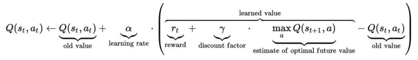
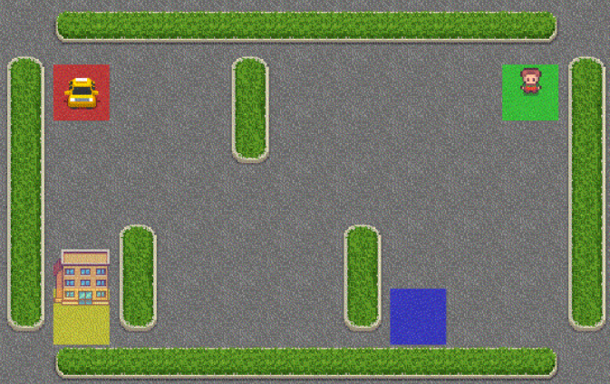
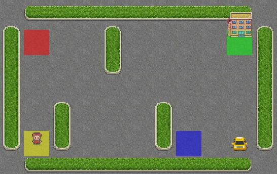

# Lab 11 - Q-Learning

## I. Introduction

This lab aims to learn Q-Learning algorithm via leveraging `gym` environment, to be specific, `Taxi-v3` in `gym`.

### <span id="updating_algorithm">Q-Learning</span>

The point of Q-Learning is Q-table and its updating algorithm which is like this:




where, as you know, $s$ is a certain state and $a$ is a certain action.

### Taxi-v3 of gym

Briefly, gym library is a collection of problems — environments — that you can use to work out your reinforcement learning algorithms. 

We use "Taxi-v3" environment to learn Q-Learning. It is a problems about taxi where the taxi needs to find a way to pick up a passenger and drop it off at the destination (hotel).



In this problem, there are 6 actions, which are 4 directions, picking up and dropping off passenger,  and 500 states. Details are in [gym official document](https://www.gymlibrary.ml/environments/toy_text/taxi/).


## II. Implementation

Dependencies:

```python
import numpy as np
import pickle
import gym
# also you need to install pygame which is invoked by gym implictly
```

### Initialize Environment

```python
def init():
    ...
    env = gym.make("Taxi-v3", new_step_api=True)
    action_space_n = env.action_space.n
    state_space_n = env.observation_space.n
    ...
    Q_table = np.zeros((state_space_n, action_space_n))
```

### Train & Gain Q-table

We use`train()` to train it and get Q-table. After training, we store Q-table in `.pkl` which you can use in `display()`.

What you need to implement are `select_action()` and [updating algorithm](#updating_algorithm).

```python
def select_action(state):
    ...
    # TODO: Select an action who can lead to a maximum Q value
    action = 0
    ...

def train():
    ...
    # TODO: Update the Q table
    Q_table[state, action] = 0
    ...
```

### Display

After training, you can invoke `display()` to watch the trajectory taxi takes in the map.

### Sample Result



## III. Lab Requirements

Please finish the **Exercise** and answer **Questions**. 

### Exercise

Read `taxi.py` and complete the Q learning algorithm by filling the *blank* places.

**Evaluation result:** The average reward over 100 episodes (use `eval()`)

What you should submit:

1. File: your code
2. Report: your results and brief comments

### Questions

1. What are the strengths of RL; when does it perform well?

2. What are the weaknesses of RL; when does it perform poorly?

3. What makes RL a good candidate for the planning/decision problem, if you have enough knowledge about the problem?

Have fun. :slightly_smiling_face: