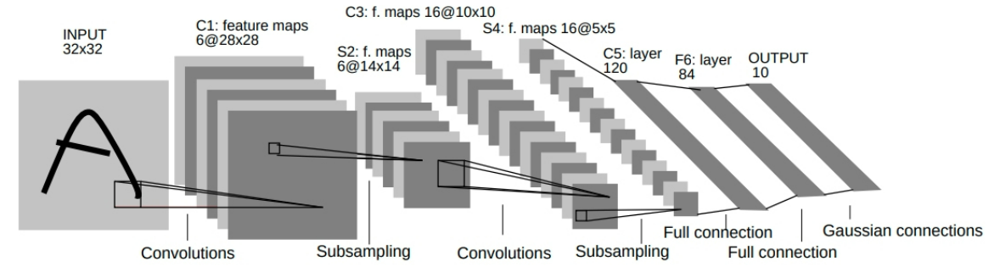

# Lab 6 - Neural Network

## I. Introduction

**PyTorch** is an open source machine learning framework that commonly used for research prototyping and production deployment. In this lab, we will train an image classifier using neural networks (NNs) under PyTorch. A simple NN as below can be constructed using the ***torch.nn*** package.



*LeNet-5* (above figure)  is a simple feed-forward network. It takes the input, feeds it through

several layers one after the other, and then finally gives the output. 

A typical training procedure for a neural network is as follows:

- Define a neural network (with learnable parameters, also called weights)

- Iterate over a dataset of inputs

- Process input through the network

- Compute the loss (how far is the output from being correct)

- Propagate gradients back into network's parameters

- Update weights of network, a simple rule: 
  $$
  \begin{align}
  w = w + \Delta w\\
  \Delta w = -\eta\frac{\partial{E}}{\partial w} 
  \end{align}
  $$
  $w$: weight

  $\eta$: learning rate

  $\frac{\partial{E}}{\partial w}$: gradient

## II. Define Network

In this section, we present an example about how to define a neural network

```python
import torch
import torch.nn as nn
import torch.nn.functional as F
```

```python
class Net(nn.Module):

    def __init__(self):
        super(Net, self).__init__()
        # kernel
        # 1 input channel, 6 output channel, 3x3 square convolution
        self.conv1 = nn.Conv2d(1, 6, (3, 3))  # or nn.Conv2d(1, 6, 3)
        self.conv2 = nn.Conv2d(6, 16, (3, 3))
        # an affine operation: y = Wx + b
        self.fc1 = nn.Linear(16 * 6 * 6, 120)
        self.fc2 = nn.Linear(120, 84)
        self.fc3 = nn.Linear(84, 10)

    def forward(self, x):
        """
        :param x: (B, C, H, W), C=1, H=32, W=32
        :return: (B, 10)
        """
        # Max pooling over a (2, 2) window
        x = F.max_pool2d(F.relu(self.conv1(x)), (2, 2))
        # If the size is a square you can specify a single number
        x = F.max_pool2d(F.relu(self.conv2(x)), 2)

        batch = x.shape[0]
        x = x.view(batch, -1)
        x = F.relu(self.fc1(x))
        x = F.relu(self.fc2(x))
        x = self.fc3(x)
        return x


net = Net()
print(net)
```

```text
# Output
Net(
  (conv1): Conv2d(1, 6, kernel_size=(3, 3), stride=(1, 1))
  (conv2): Conv2d(6, 16, kernel_size=(3, 3), stride=(1, 1))
  (fc1): Linear(in_features=576, out_features=120, bias=True)
  (fc2): Linear(in_features=120, out_features=84, bias=True)
  (fc3): Linear(in_features=84, out_features=10, bias=True)
)
```

For a pytorch network, we need to define `forward` function, and the *backward* function (where gradients are computed) will be automatically defined using *autograd* of pytorch. You can use any of the Tensor operations in the `forward` function.

- Finds all parameters of model: `nn.Module.parameters()` 

```python
params = list(net.parameters())
print(len(params)) # contains weights and bias
print(params[0].size()) # conv1's weight
print(params[1].size()) # conv1's bias
```

```text
# output
10
torch.Size([6, 1, 3, 3])
torch.Size([6])
```

- Process input through model:`forward`

Then, we can input a random $32\times32$ data (in fact, the input's size can be from 30 to 33). After forward propagation, in most cases, you should **clear the gradient buffers** of all parameters.

```python
test = torch.randn((1, 1, 32, 32))
pred = net(test) # forward
print(pred)

net.zero_grad() # clear gradient buffer
```

```text
# output
tensor([[ 0.0187,  0.0414, -0.0504,  0.0542,  0.1089, -0.0450,  0.0766,  0.0449,
         -0.0405, -0.0206]], grad_fn=<AddmmBackward0>)
```

You can also backward propagate with specified gradients:

```python
grad = torch.randn(1,10)
pred.backward(grad)
```

#### Summary

We covered:

- Defining a neural network
- Processing inputs and calling backward

## III. Loss Function

A loss function takes the (output, target) pair of inputs, and computes a value that <u>estimates how far away the output is from the target</u>. There are several different loss functions under the `torch.nn` package . 

###### `nn.MSELoss`

Compute **mean-squared error** between input and target.

```python
target = torch.randn(1, 10) # generate a random target (size should be the same as pred's)
criterion = nn.MSELoss()

loss = criterion(pred, target)
print(loss)
```

```text
# output
tensor(1.8541, grad_fn=<MseLossBackward0>)
```

## IV. Backpropagation

To backpropagate the error all we have to do is to use `loss.backward( )` You need to clear the existing gradients; otherwise new gradients values will be accumulated to existing values. 

Now we can call `loss.backward( )`, and have a look at conv1’s bias gradients before and after the backpropagation. 

```python
net.conv1.bias.grad = torch.zeros(6)
print("conv1.bias.grad before backward")
print(net.conv1.bias.grad)

loss.backward()

print("conv1.bias.grad after backward")
print(net.conv1.bias.grad)
```

```text
# output
conv1.bias.grad before backward
tensor([0., 0., 0., 0., 0., 0.])
conv1.bias.grad after backward
tensor([ 0.0028,  0.0079, -0.0119, -0.0041,  0.0008, -0.0046])
```

#### Update Weights

The simplest update rule used in practice is the **Stochastic Gradient Descent (SGD)**:
$$
w = w - \eta\frac{\partial{E}}{\partial w}
$$
We can implement **SGD** with simple python code:

```python
learning_rate = 0.01
for f in net.parameters():
    f.data.sub_(f.grad.data * learning_rate)
```

However, under the Pytorch framework, various optimizers with different update rules such as *SGD*, *Nesterov-SGD*, *Adam*, *RMSProp* have been implemented. To use these optimizers, we need import a small package of ***torch.optim*** .

```python
import torch.optim as optim

# create optimizer
optimizer = optim.SGD(net.parameters(), lr=0.01)

# in your training loop:
optimizer.zero_grad()  # clear gradient buffer
output = net(input)
loss = criterion(output, target)
loss.backward()
optimizer.step()  # update parameters of net
```

## VI. Lab Requirement

Please finish **Exercise** and **Questions**.

#### Exercise

Follow the above instructions of Image Classifier Training with PyTorch to train your own image classifier (using the [CIFAR10 dataset](https://pytorch.org/tutorials/beginner/blitz/cifar10_tutorial.html), or another dataset you prefer). 

Please try to improve performance of classification by trying different network structures (add layers, modify parameters and so on) and different training strategies (loss function, optimizer and so on). 

#### Questions

1. Can neural networks be used for unsupervised clustering or data dimension reduction? Why?

2. What are the strengths of neural networks; when do they perform well?

3. What are the weaknesses of neural networks; when do they perform poorly?

4. What makes neural networks a good candidate for the classification regression problem, if you have enough knowledge about the data?